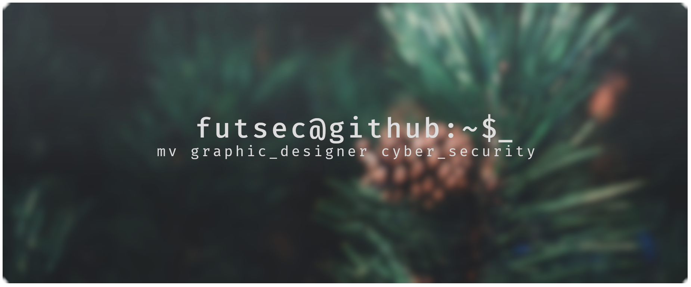

<div align="center">
    <a href="https://github.com/Futsec/futsec">
        
    </a>
</div>

<br>
<br>

## Table of Contents
- Getting Started
    - System Setup
    - Configuring Gnome.Mutter
    - Installing Vim Plug

## Getting Started
Run an update on your system,

```sh
    sudo dnf upgrade  -y
```

Once done, reboot your system.
```sh
    sudo reboot
```

After reboot, install these package.

```sh
    sudo dnf install wget curl vim git openvpn
```

### System Setup
Setup your ssh keys, create your workspace directories, clone this repo and cp your configs over to home.

```sh
    ssh-keygen -t ed25519 -C '229901212+Futsec@users.noreply.github.com'
```

```sh
    mkdir -pv ~/workspace/local ~/workspace/repo/personal ~/workspace/repo/study ~/workspace/repo/work
```

```sh
    cd ~/workspace/repo/personal && git clone git@github.com:Futsec/futsec.git
```

```sh
    cp -v futsec/home/.* ~
```

### Configuring Gnome.Mutter
Configure gsettings to not auto-maximize your windows, allowing you to have a predetermined sizes.

```sh
    gsettings set org.gnome.mutter auto-maximize false
```

### Installing Vim Plug
Install your plugin manager for vim.

```sh
    curl -fLo ~/.vim/autoload/plug.vim --create-dirs \
    https://raw.githubusercontent.com/junegunn/vim-plug/master/plug.vim
```
